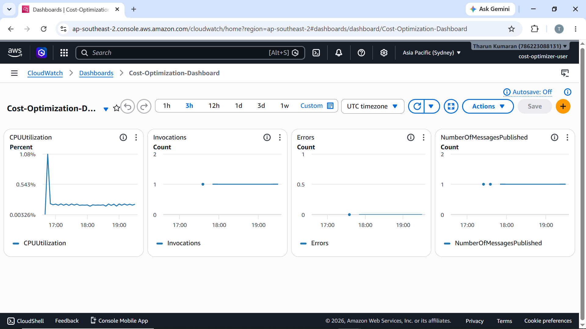
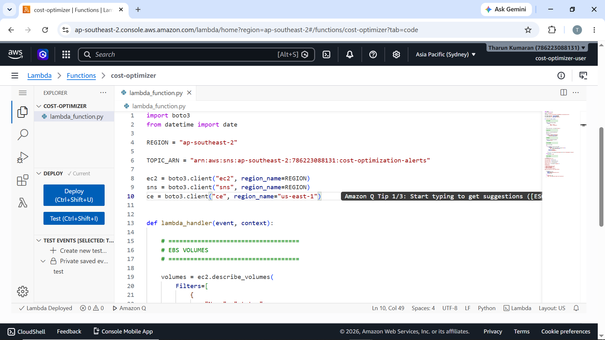
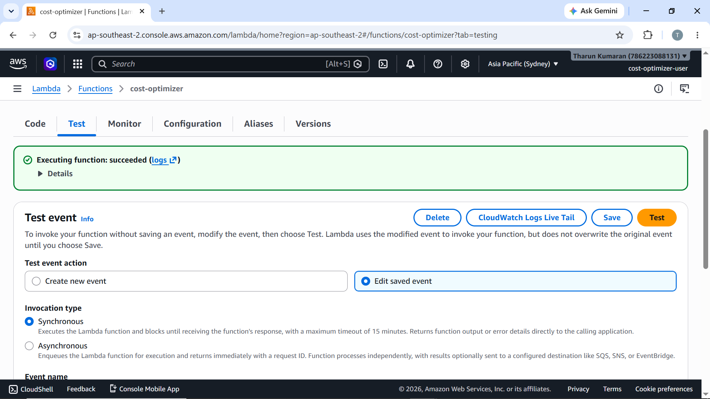
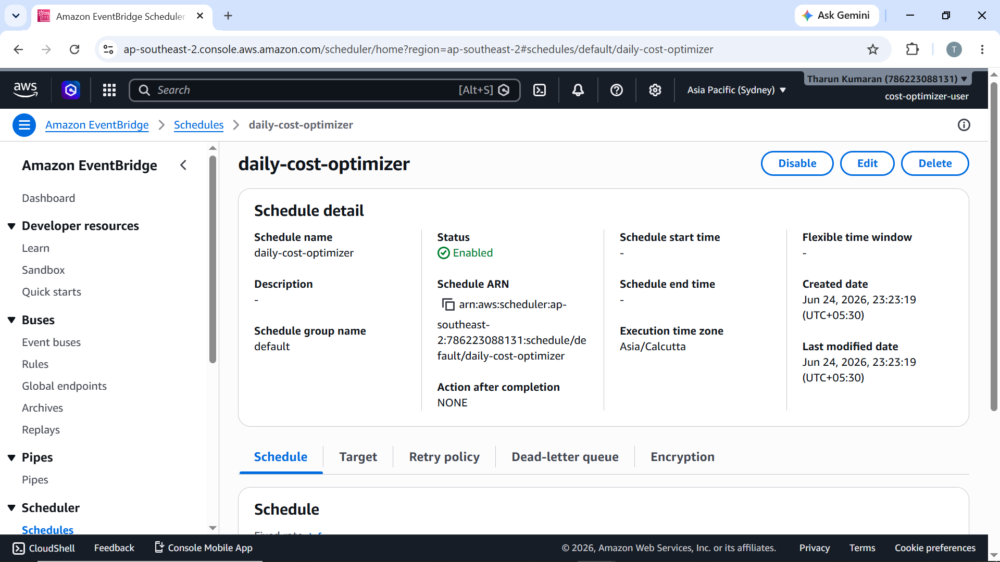
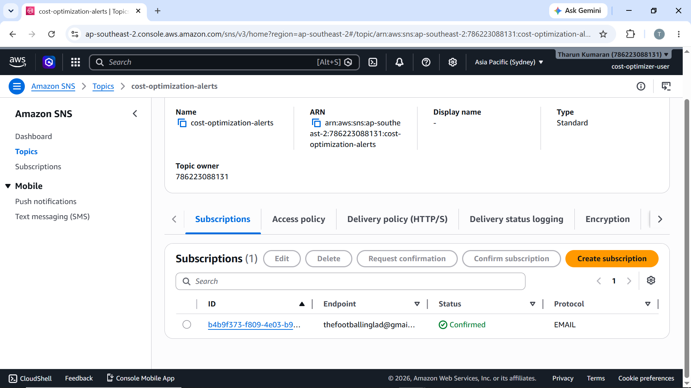
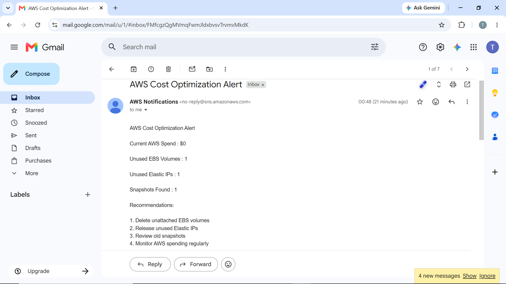
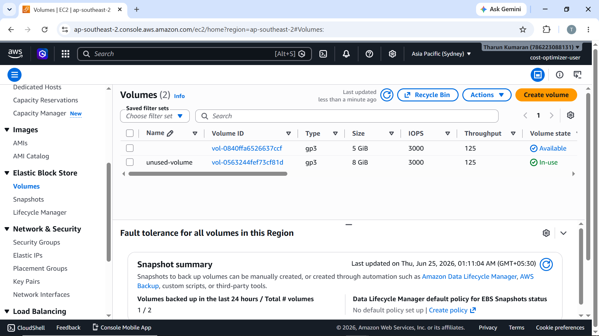
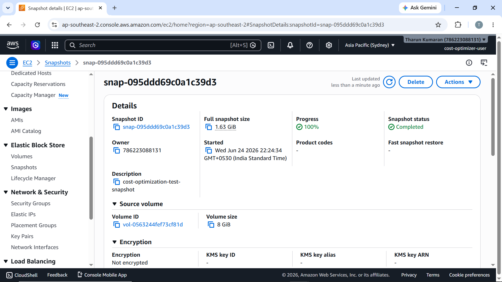
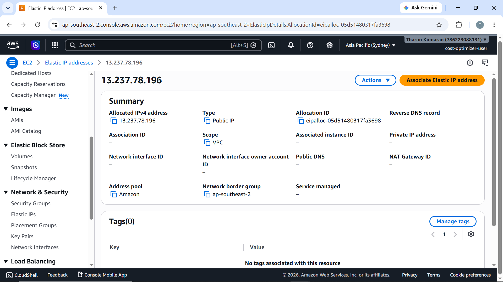
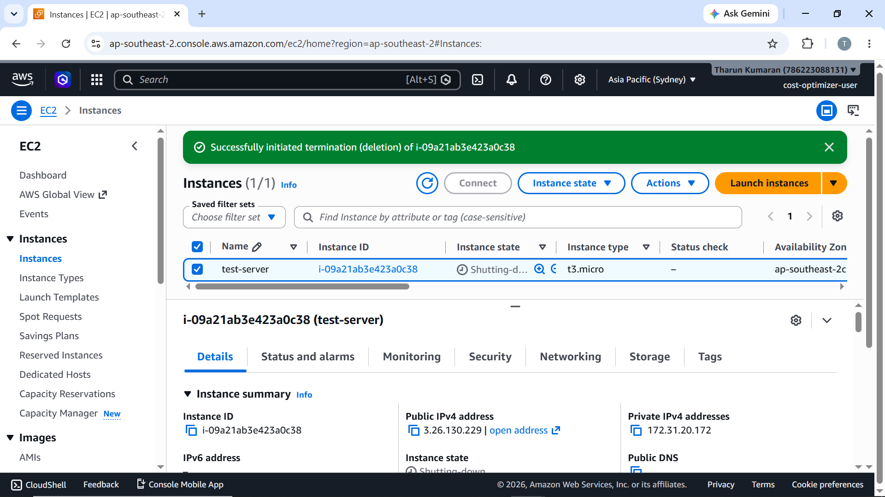

# AWS FinOps Cost Optimization & Monitoring Platform

An automated AWS cost monitoring and alerting system that detects unused resources and sends daily email notifications with optimization recommendations.

---

## Architecture Overview

```
EventBridge Scheduler (Daily)
        │
        ▼
  Lambda Function
  (cost-optimizer)
        │
        ├── Scans EBS Volumes (unused/available)
        ├── Scans Elastic IPs (unassociated)
        ├── Scans EBS Snapshots
        └── Queries AWS Cost Explorer
                │
                ▼
          SNS Topic
    (cost-optimization-alerts)
                │
                ▼
         Email Notification
```

---

## Features

- **Unused EBS Volume Detection** — Identifies EBS volumes in `available` state (not attached to any instance)
- **Unassociated Elastic IP Detection** — Finds Elastic IPs allocated but not associated with any resource
- **EBS Snapshot Inventory** — Lists all owned snapshots for review
- **AWS Cost Explorer Integration** — Fetches current month's AWS spend
- **Daily Automated Alerts** — EventBridge Scheduler triggers the function every day
- **Email Notifications via SNS** — Sends a formatted cost optimization report to subscribed email addresses
- **CloudWatch Dashboard** — Visual monitoring of Lambda invocations, errors, and SNS message counts

---

## AWS Services Used

| Service | Purpose |
|---|---|
| AWS Lambda | Core function to scan resources and publish alerts |
| Amazon SNS | Sends email notifications to subscribers |
| Amazon EventBridge Scheduler | Triggers Lambda on a daily schedule |
| Amazon CloudWatch | Dashboard for monitoring Lambda metrics |
| AWS Cost Explorer | Retrieves current billing data |
| Amazon EC2 (boto3) | Queries EBS volumes, Elastic IPs, and snapshots |

---

## Project Structure

```
aws-cost-optimizer/
├── lambda_function.py     # Main Lambda handler
└── README.md
```

---

## Lambda Function — What It Does

**`lambda_function.py`** is written in Python using `boto3` and performs the following on each invocation:

1. **EBS Volumes** — Queries all volumes with state `available` (unattached)
2. **Elastic IPs** — Queries all allocated Elastic IPs with no association
3. **Snapshots** — Lists all EBS snapshots owned by the account
4. **Cost Explorer** — Retrieves the current month's total AWS spend (queried from `us-east-1`)
5. **SNS Publish** — Composes and sends an alert message with findings and recommendations

### Key Configuration (top of file)

```python
REGION = "ap-southeast-2"
TOPIC_ARN = "YOUR_SNS_TOPIC_ARN"
```

---

## Setup Instructions

### Prerequisites

- AWS account with appropriate IAM permissions
- Python 3.x Lambda runtime
- `boto3` (included in Lambda runtime by default)

### IAM Permissions Required

The Lambda execution role needs the following permissions:

```json
{
  "Effect": "Allow",
  "Action": [
    "ec2:DescribeVolumes",
    "ec2:DescribeAddresses",
    "ec2:DescribeSnapshots",
    "sns:Publish",
    "ce:GetCostAndUsage"
  ],
  "Resource": "*"
}
```

### Deployment Steps

**1. Create the SNS Topic**
- Go to **Amazon SNS → Topics → Create topic**
- Type: Standard
- Name: `cost-optimization-alerts`
- Add an email subscription and confirm it

**2. Deploy the Lambda Function**
- Go to **Lambda → Functions → Create function**
- Runtime: Python 3.x
- Paste the code from `lambda_function.py`
- Update `REGION` and `TOPIC_ARN` with your values
- Attach the IAM role with permissions above
- Deploy

**3. Test the Function**
- Go to the **Test** tab in Lambda
- Create a test event (empty JSON `{}` works)
- Click **Test** — verify it succeeds and you receive an email

**4. Create the EventBridge Schedule**
- Go to **EventBridge → Scheduler → Schedules → Create schedule**
- Name: `daily-cost-optimizer`
- Schedule: Recurring (e.g., `cron(0 2 * * ? *)` for 2 AM UTC daily)
- Target: Lambda function → `cost-optimizer`
- Timezone: Set to your preferred timezone

**5. Create the CloudWatch Dashboard** *(optional)*
- Go to **CloudWatch → Dashboards → Create dashboard**
- Name: `Cost-Optimization-Dashboard`
- Add widgets for: `CPUUtilization`, `Invocations`, `Errors`, `NumberOfMessagesPublished`

---

## Sample Alert Email

```
AWS Cost Optimization Alert

Current AWS Spend : $0

Unused EBS Volumes : 1
Unused Elastic IPs : 1
Snapshots Found : 1

Recommendations:
1. Delete unattached EBS volumes
2. Release unused Elastic IPs
3. Review old snapshots
4. Monitor AWS spending regularly
```

---

## CloudWatch Dashboard

The dashboard tracks:

- **Invocations** — Number of times the function ran
- **Errors** — Any Lambda execution errors
- **Duration** — How long each invocation took
- **Throttles** — Invocations throttled due to concurrency limits
- **SNS Messages Published** — Confirms alerts are going out

---

## Screenshots

### CloudWatch Dashboard


### Lambda Function


### Lambda Test


### EventBridge Scheduler


### SNS Subscription


### Email Alert


### Unused EBS Volume


### Snapshot


### Elastic IP


### EC2 Termination Test


---

## Region

All resources are deployed in **ap-southeast-2 (Asia Pacific — Sydney)**, except Cost Explorer which is queried from `us-east-1` (AWS requirement).

---

## Cost of This Solution

This solution itself is extremely low-cost:

- **Lambda** — Free tier covers 1M requests/month; daily invocation = ~30 calls/month
- **SNS** — First 1,000 email notifications per month are free
- **EventBridge Scheduler** — First 14M scheduler invocations/month are free
- **Cost Explorer API** — Cost Explorer API charges may apply based on AWS pricing

**Estimated monthly cost: < $0.05**

---

## Skills Demonstrated

- AWS Lambda
- Amazon SNS
- Amazon EventBridge Scheduler
- Amazon CloudWatch
- AWS Cost Explorer
- Amazon EC2
- Amazon EBS
- IAM
- Python (Boto3)
- Serverless Architecture
- AWS FinOps
- Cloud Cost Optimization

---

## Author

**Tharun Kumaran**  
Region: `ap-southeast-2`
